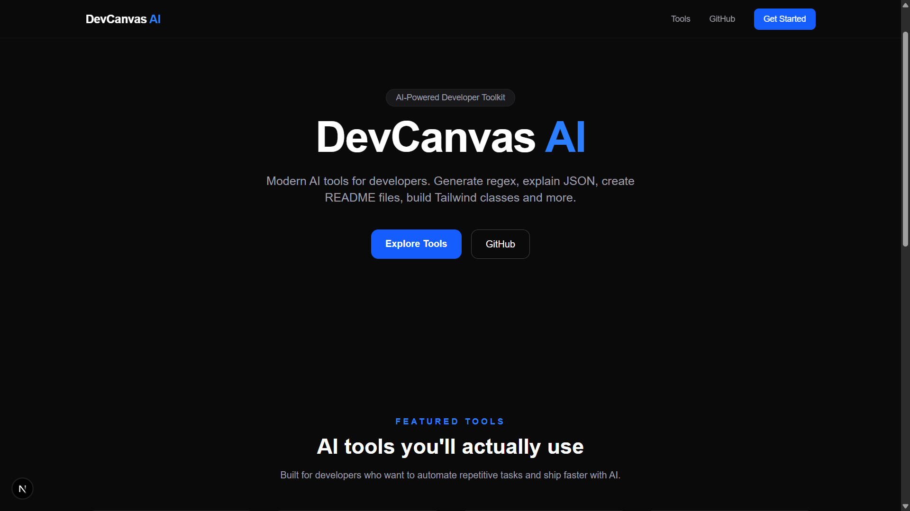
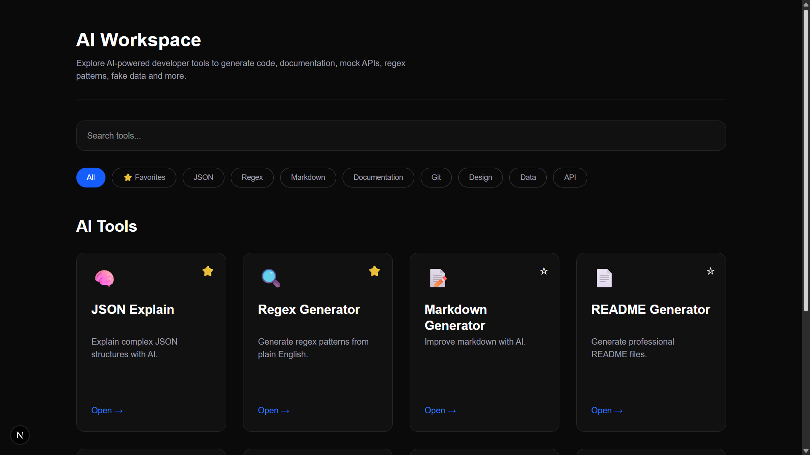
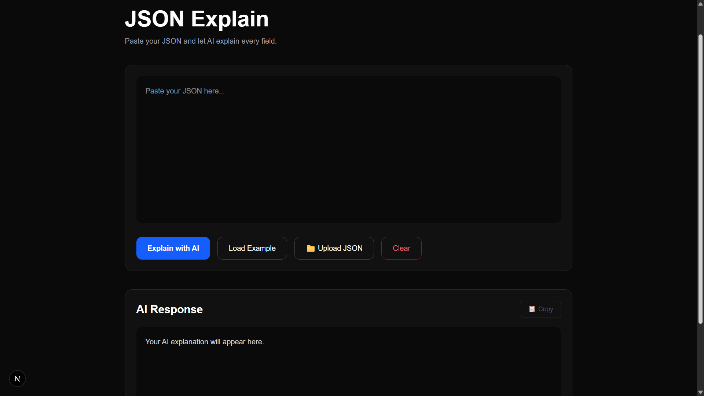
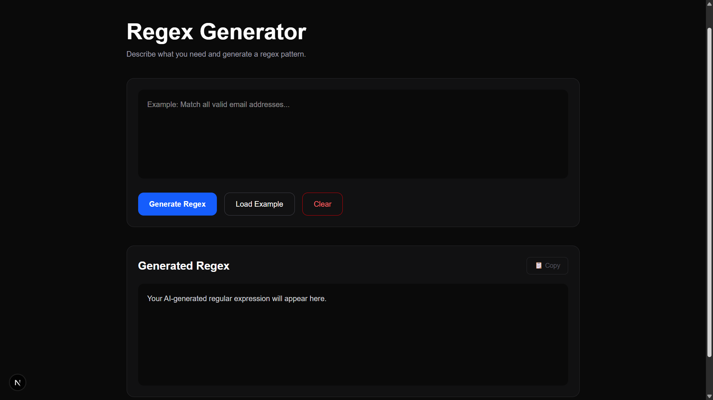
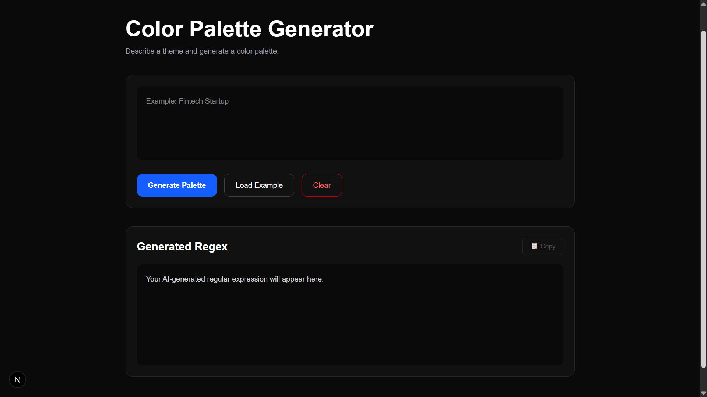
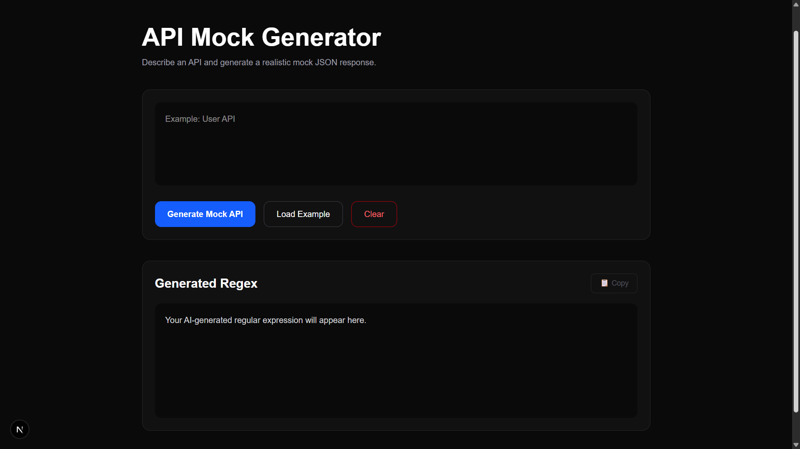

# 🚀 DevCanvas AI

Modern AI-powered developer toolkit built with **Next.js**, **React**, **TypeScript** and **Tailwind CSS**.

DevCanvas AI provides a collection of developer tools designed to simplify common development tasks through a clean, fast and responsive interface.

> ⚠️ **Current Status**
>
> This is the first stable release (**v1.0**).
> AI responses are currently demo content. OpenAI integration is planned for a future release.

---

# ✨ Features

- 🧠 JSON Explain
- 🔍 Regex Generator
- 📝 Markdown Generator
- 📄 README Generator
- 🌿 Git Commit Generator
- 🎨 Color Palette Generator
- 👥 Fake Data Generator
- ⚡ API Mock Generator

Additional features:

- ⭐ Favorite tools (LocalStorage)
- 🔎 Search
- 🗂 Category filtering
- 🌙 Dark UI
- 📱 Fully Responsive
- 📋 Copy to Clipboard
- ⚡ Fast Next.js App Router architecture
- 🔍 SEO Optimized

---

# 🛠 Tech Stack

- Next.js 16
- React 19
- TypeScript
- Tailwind CSS 4
- App Router
- LocalStorage

---

# 📸 Screenshots

> Screenshots will be added soon.

## Landing Page



---

## Dashboard



---

## JSON Explain



---

## Regex Generator



---

## Color Palette Generator



---

## API Mock Generator



---

# 🚀 Installation

Clone the repository

```bash
git clone https://github.com/YOUR_USERNAME/devcanvas-ai.git
```

Go to the project

```bash
cd devcanvas-ai
```

Install dependencies

```bash
npm install
```

Run the development server

```bash
npm run dev
```

Build for production

```bash
npm run build
```

Start production server

```bash
npm run start
```

---

# 📂 Project Structure

```
app/
components/
lib/
public/
```

---

# 📈 Project Status

✅ Landing Page

✅ Dashboard

✅ Responsive Design

✅ Search

✅ Favorites

✅ Category Filter

✅ SEO

✅ Production Build

⏳ OpenAI Integration (Planned)

---

# 🗺 Roadmap

### Version 1.0

- ✅ Developer tools
- ✅ Responsive UI
- ✅ Dashboard
- ✅ Production ready
- ✅ SEO optimization

### Future

- 🔜 OpenAI integration
- 🔜 AI-powered responses
- 🔜 Additional developer tools

---

# 👩‍💻 Author

**Esra Bilgiz**

Software Developer

---

# 📄 License

MIT License