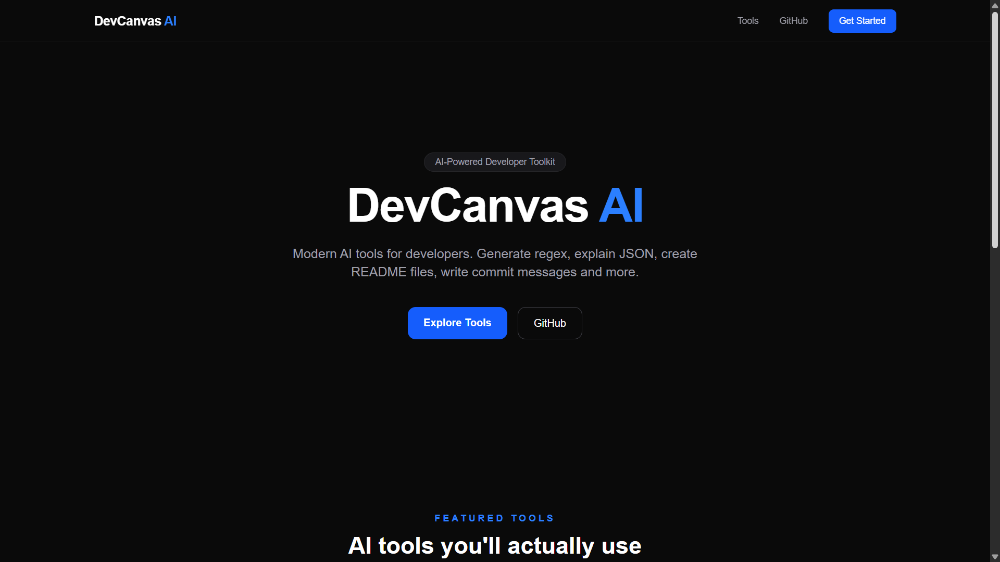
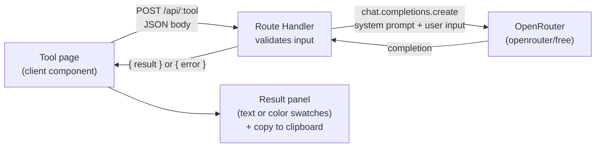
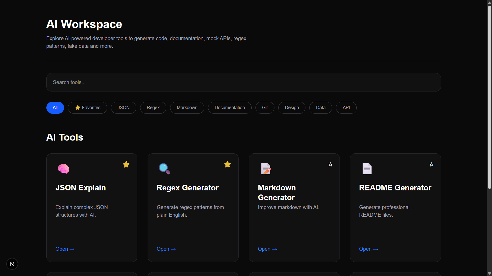
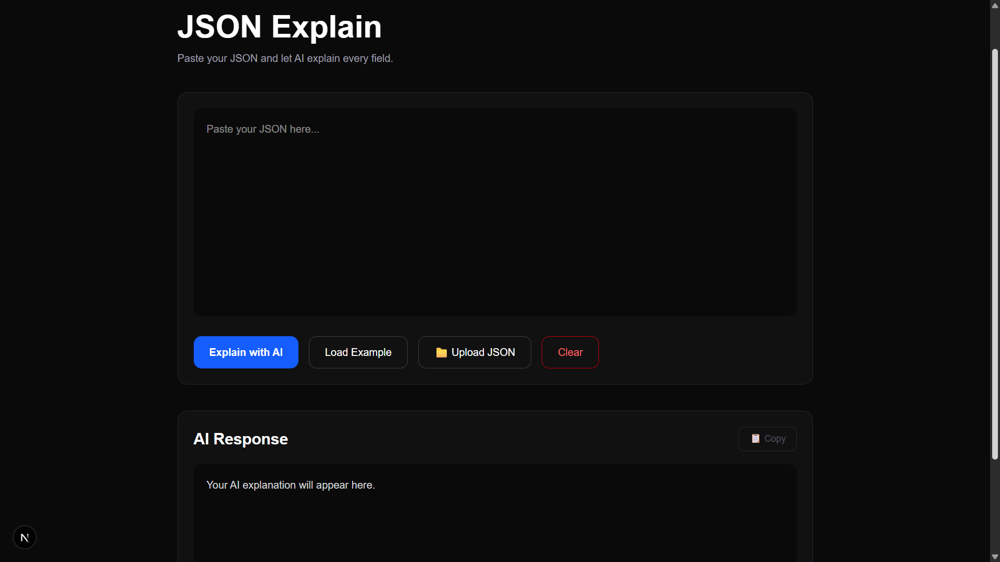
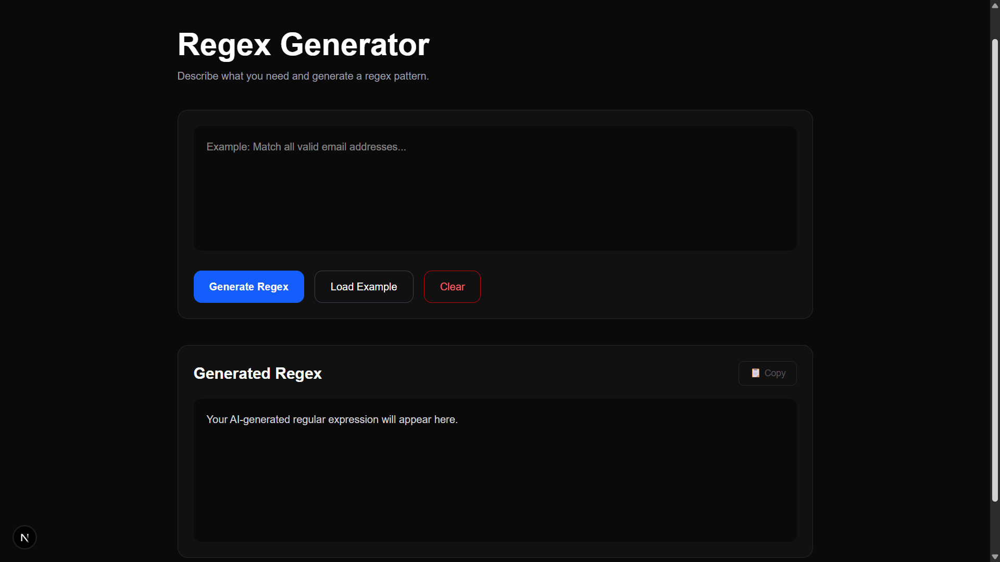
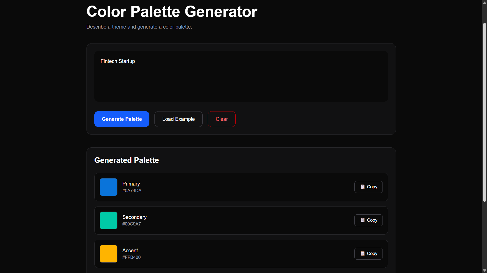
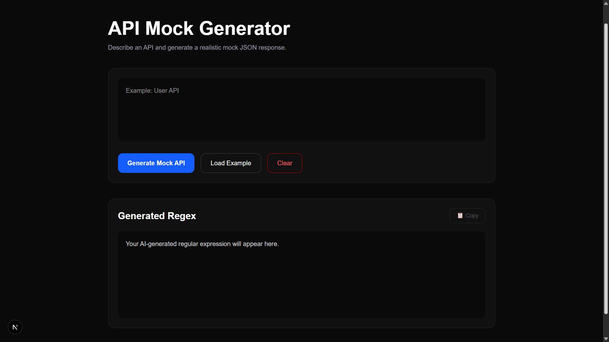

# DevCanvas AI

An AI-powered developer toolkit with eight focused tools — JSON explainer, regex, README and commit message generators, mock data and more — built with Next.js 16 and OpenRouter.




## Features

**AI tools** — each tool has its own page and its own API route:

| Tool | What it does |
|---|---|
| JSON Explain | Explains a JSON document in beginner-friendly terms. Validates the JSON in the browser first and supports uploading a `.json` file. |
| Regex Generator | Turns a plain-English description into a regex with a short explanation. |
| Markdown Generator | Rewrites Markdown for clarity and structure. |
| README Generator | Writes a README from a short project description. |
| Git Commit Generator | Writes a Conventional Commit message from a description of your changes. |
| Color Palette Generator | Generates a 5-color palette (primary, secondary, accent, background, text) for a theme and renders it as swatches. |
| Fake Data Generator | Generates realistic mock data as JSON. |
| API Mock Generator | Generates a realistic JSON response for a described endpoint. |

**Across the app**

- "Load Example", "Clear", loading states and copy-to-clipboard on every tool
- Dashboard with search (title, description, category), category filters and favorites stored in `localStorage`
- The API key is only read on the server; every route validates its input and returns `400` on empty requests
- SEO via the Next.js Metadata API: Open Graph / Twitter cards, `robots.txt` and `sitemap.xml`
- Responsive dark UI

## Tech Stack

- **Framework:** Next.js 16 (App Router, Route Handlers), React 19
- **Language:** TypeScript 5
- **Styling:** Tailwind CSS 4
- **AI:** [OpenAI Node SDK](https://github.com/openai/openai-node) pointed at [OpenRouter](https://openrouter.ai)'s OpenAI-compatible API — default model `openrouter/free`, configurable in [`lib/ai.ts`](lib/ai.ts)
- **Tooling:** ESLint 9 (`eslint-config-next`)
- **Hosting:** Vercel

## Architecture


```mermaid
flowchart LR
    A["Tool page<br/>(client component)"] -- "POST /api/:tool<br/>JSON body" --> B["Route Handler<br/>validates input"]
    B -- "chat.completions.create<br/>system prompt + user input" --> C["OpenRouter<br/>(openrouter/free)"]
    C -- "completion" --> B
    B -- "{ result } or { error }" --> A
    A --> D["Result panel<br/>(text or color swatches)<br/>+ copy to clipboard"]
```

1. The user fills in a tool page (`app/tools/<tool>/page.tsx`), which sends a `POST` request to its route.
2. The route handler (`app/api/<tool>/route.ts`) validates the body and calls OpenRouter through the OpenAI SDK with a tool-specific system prompt.
3. The model's text is returned as `{ result }` and shown in the result panel; failures return `{ error }` with a generic message (details are logged server-side).

## API Routes

All routes accept `POST` with a JSON body, use `temperature: 0.3`, and respond with `{ result: string, truncated: boolean }` or `{ error: string }`. `truncated` is `true` when the model stopped at the `max_tokens` limit (`finish_reason: "length"`), and the UI then shows an "Output was cut off" notice. If the model hits the limit before producing any text, `result` is empty and the UI asks for a shorter request instead.

| Endpoint | Body | Purpose | `max_tokens` |
|---|---|---|---|
| `/api/explain-json` | `{ json }` | Explain JSON in beginner-friendly terms | 800 |
| `/api/regex-generator` | `{ prompt }` | Regex + brief explanation | 300 |
| `/api/markdown-generator` | `{ markdown }` | Improve Markdown clarity and structure | 1000 |
| `/api/readme-generator` | `{ description }` | README from a project description | 1500 |
| `/api/git-commit-generator` | `{ changes }` | Conventional Commit message | 300 |
| `/api/color-palette-generator` | `{ theme }` | 5-color palette as `Name: #HEX` pairs | 300 |
| `/api/fake-data-generator` | `{ prompt }` | Mock data as JSON | 800 |
| `/api/api-mock-generator` | `{ prompt }` | Mock API response as JSON | 800 |

## Getting Started

**Prerequisites:** Node.js 20.9+ and an [OpenRouter API key](https://openrouter.ai/keys).

```bash
git clone https://github.com/blgzesra/devcanvas-ai.git
cd devcanvas-ai
npm install
cp .env.example .env.local
```

Add your key to `.env.local`:

```env
OPENROUTER_API_KEY=your-openrouter-key
```

Start the dev server and open [http://localhost:3000](http://localhost:3000):

```bash
npm run dev
```

| Script | Description |
|---|---|
| `npm run dev` | Start the development server |
| `npm run build` | Create a production build |
| `npm run start` | Serve the production build |
| `npm run lint` / `npm run lint:fix` | Lint (and auto-fix) with ESLint |
| `npm run typecheck` | Type-check with `tsc --noEmit` |

> **Deploying to Vercel:** add `OPENROUTER_API_KEY` under *Project Settings → Environment Variables*.

## Project Structure

```
app/
  api/<tool>/route.ts     # One Route Handler per tool (OpenRouter call)
  tools/<tool>/page.tsx   # One client page per tool
  dashboard/page.tsx      # Search, category filters, favorites
  page.tsx                # Landing page
  robots.ts, sitemap.ts   # SEO
components/
  dashboard/  layout/  sections/  tools/
lib/
  ai.ts                   # Model configuration
  tools.ts                # Tool registry (title, category, route)
docs/screenshots/         # README images
```

## Screenshots

| Dashboard | JSON Explain |
|---|---|
|  |  |

| Regex Generator | Color Palette Generator |
|---|---|
|  |  |

| API Mock Generator |
|---|
|  |

## Known Limitations

- **No streaming:** responses arrive in one piece after the model finishes.
- **Output length is capped** per tool (300–1500 `max_tokens`); when a response hits the cap, the UI flags it as cut off rather than silently truncating.
- **Plain-text output:** results are not rendered as Markdown and code is not syntax-highlighted (palettes are the exception).
- **Free model tier:** `openrouter/free` can be rate-limited and output quality varies between requests.
- **No rate limiting or authentication** on the API routes.
- **Favorites are per-browser**, stored in `localStorage`.
- **No automated tests** yet.

## Roadmap

- [ ] Stream responses to the UI
- [ ] Render Markdown and syntax-highlight code in results
- [ ] Rate limiting for the API routes
- [ ] Automated tests for routes and UI
- [ ] Share the duplicated route logic (client, response parsing) in one helper

## Author

**Esra Bilgiz** — [GitHub](https://github.com/blgzesra)

## License

[MIT](LICENSE)
